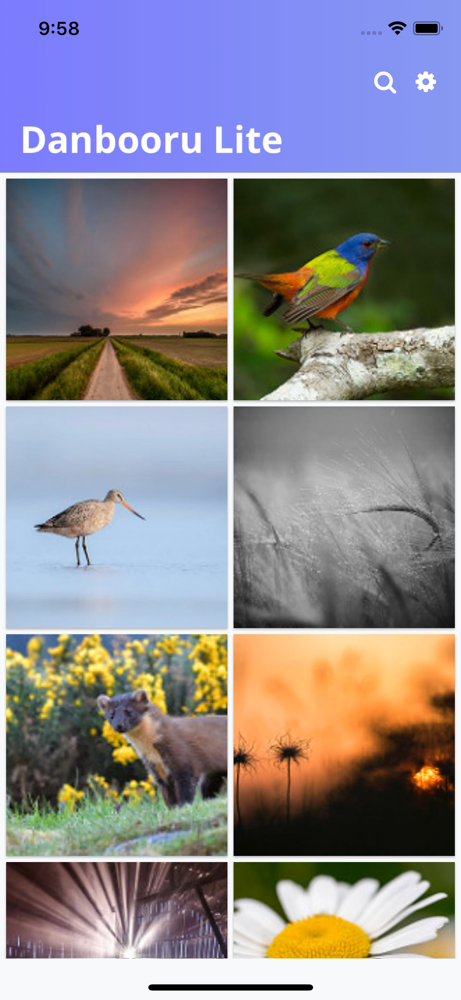
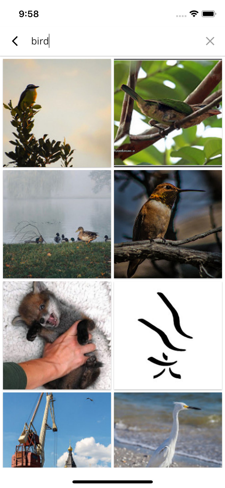
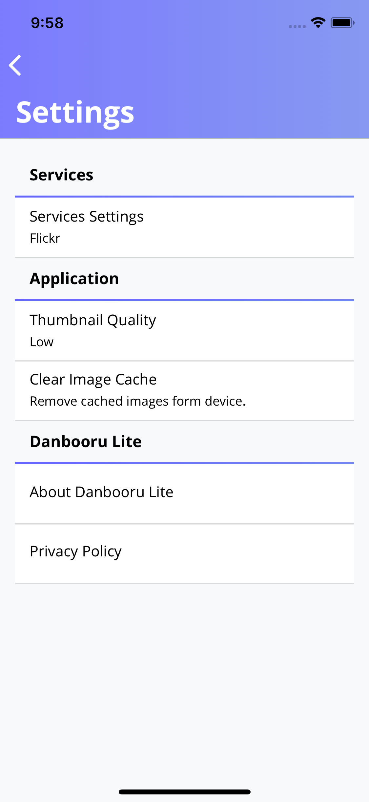

    
     
     
    
    

# Danbooru-Lite 
Danbooru Lite allows you to connect to a various photo hosting services and browse images. Download any image to your device's storage, or set it as your new wallpaper. Share images with friends via your favorite messaging app

|||||
| ---------- | ---------- | ---------- | ---------- | 
|||||

